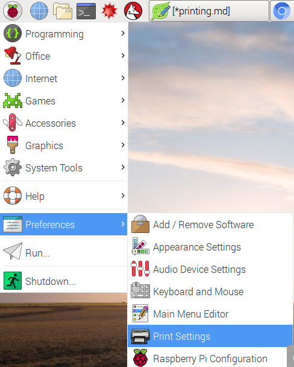
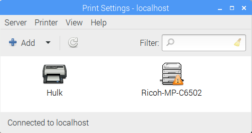
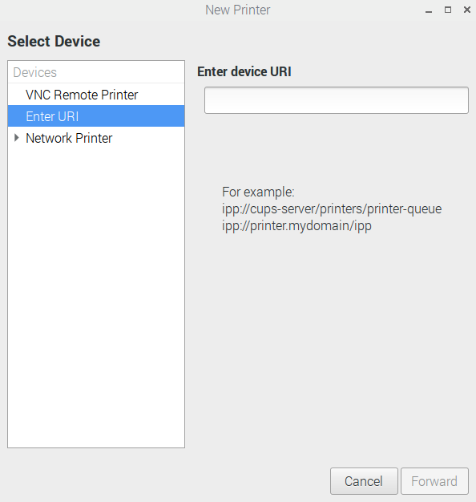
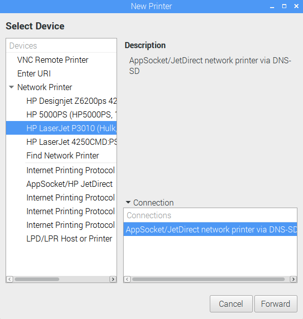
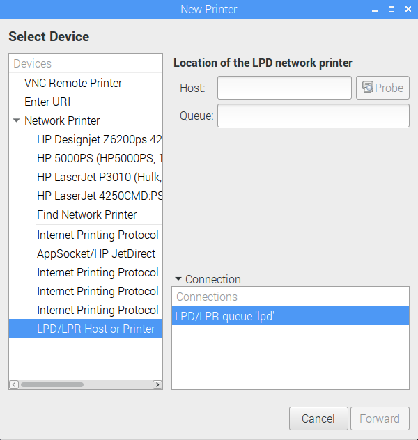
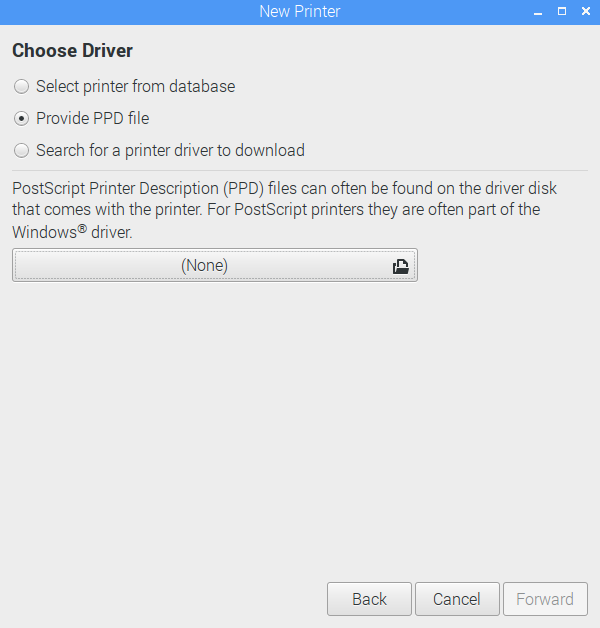

# Printing in the raspberry pi

Created on July 7, 2017

## Objective 

My second task when I began working on this project with Wu-Jung Lee was:

2. Set up printer at APL to print the figures from task 1 (printer IP in the attached file, 
   Hulk is black and white and Procolor is color. Procolor may be harder to set up.)

This was one of the tasks I needed to complete by around July 5, 2017.

### Disclaimer

The main purpose of this file will be describe the process I went through in trying to complete
this task. I will be describing strategies or "solutions" which did not end up helping me 
complete this task. I will also describing problems I encountered in in the printing process.

#### What worked.

So there are two printers I have to set the raspberry pi (denoted RPi from now on) to:

1. The HP LaserJet P3015, Hostname Hulk
2. The Ricoh C6502, Hostname Procolor

I immediately downloaded the CUPS printing interface using the following command on the terminal,
with reference to the webpage I used to help me [download it](https://help.ubuntu.com/lts/serverguide/cups.html).

```
sudo apt install cups
```

Then a week later after much difficulty, I asked for IT help (which honestly, I should have done much sooner).

He found a very simple solution to the problem I was having for the past week: I was not connected to the network
of printers. All I had to do to establish a connection with the network from what I can recall is to simply
connect the raspberry pi to that network via ethernet cable.

From there we mainly worked from the foomatic database to connect to our printers.

Using the PIXEL gui, I navigated to the printer settings as shown here:



What should come up is the printer settings interface. The two printers I wanted to set up are shown here already connected. One note however is that for the Ricoh, I managed to fix the yellow warning sign by connecting to the correct IP address for the printer. I was still able to print through the Ricoh before the fix, but the IP I used was the printer's own server.



From there, making sure I was connected to the cups server that holds the network of printers I wish to connect to via the servers tab, I then choose to add a printer. What pops up is an interface that gives you choices on what sort of printer you wish to add.



Since I want to connect to two network printers, I chose the network printers tab, and a dropdown menu of different available local printers are shown. The HP LaserJet P3015 printer is available with the hostname "Hulk". Clicking forward leads me to a series of prompts that pertain to printer settings. Once I finish configuring the printer settings, I should be connected to the printer.



Next I have to connect to the Ricoh. Since it is not shown on the network printers list, I have to connect to it manually. The Ricoh is a LPD network printer as denoted in its configuration page. In host, the IP of the printer should be typed in. Ideally probing for the printer should work, but if not, click forward to go to the next prompt.



The following prompt will give a couple options to connect to the printer. The first option is opens a database of printer drivers, this is used when you want to manually install the driver of a printer. The second option is a direct install from a ppd file. The last option is an automatic scan for the printer driver.




If the PPD file of a printer can be found, I would prefer to use the second option as it is the most direct way to connect to a printer out of the three options. With that in mind, I did find the appropriate PPD file for the Ricoh MP C6502.

The printer PPD file is shown in this link: http://www.openprinting.org/printer/Ricoh/Ricoh-MP_C6502

Openprinting is a fairly good database of printer compatibility with Linux. It essentially is a database that determines whether a specific printer is compatible with Linux, and provides links to PPD files or drivers of that printer if it is compatible.

**TLDR:
1. Start -> Preferences -> Printer Settings.
2. Check server settings, then click add printer.
3. Hulk should be listed in network printers. Follow prompts to install and configure printer.
4. Use LPD network printer for the Ricoh, enter IP in Host.
5. Input PPD file of Ricoh, follow prompts to install and configure printer.
6. Print test pages to make sure you are actually connected.**
